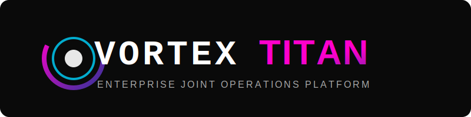

# VORTEX TITAN  
**Enterprise Simulation Platform — Joint Operations Platform**


---

## 👤 Author

**Syed Sameer Ul Hassan**  
Founder & Lead Architect — **VORTEX TITAN**

- 🌐 **Website:** https://sameer.orildo.online  
- 📧 **Email:** sameer@orildo.online  
- 🐙 **GitHub:** https://github.com/syed-sameer-ul-hassan  

### Professional Focus
- Purple Team Operations & Joint Exercises  
- Adversary Simulation & BAS Platforms  
- Red Team / Blue Team Engineering  
- Secure Systems Architecture  
- Safety-First Cybersecurity Automation  

VORTEX TITAN is developed with an **enterprise-first, safety-driven philosophy**, prioritizing deterministic execution, auditability, and operational trust for modern security teams.

---

## 🏷️ Project Information


Project Name : VORTEX TITAN
Author       : Syed Sameer Ul Hassan
License      : MIT
Status       : Enterprise Beta
role         : Cybersecurity Technician


---

## 🚀 Overview

**VORTEX TITAN** is an enterprise-grade, safety-first **Purple Team Joint Operations Platform** designed to orchestrate Red Team and Blue Team activities without introducing real-world risk.

Unlike traditional adversary emulation frameworks, VORTEX TITAN replaces:

- **Live malware** with deterministic **White Card simulations**
- **Autonomous AI agents** with **audit-ready decision matrices**
- **Unsafe execution** with **hard safety guardrails**

The platform correlates offensive actions with defensive telemetry in real time, enabling organizations to test detection, response, and coordination workflows with full traceability.

---

## 🛡️ Key Capabilities

- **Joint Operations Engine**  
  Synchronizes Red Team actions and Blue Team telemetry in a unified execution pipeline.

- **Safety Guardrails**  
  Environment-aware locks (Lab vs. Production) that block destructive commands such as `rm -rf`.

- **Deterministic Logic Engine**  
  Predictable branching logic (e.g., *if detected → evade*) for repeatable and auditable testing.

- **SQLite Persistence Layer**  
  Complete audit trails of every simulated command, decision, and outcome.

- **Zero-Day Simulation Framework**  
  “White Card” plugins simulate exploit effects without executing real payloads.

- **Automated Reporting**  
  Generates HTML dashboards with detection fidelity and response scoring.

---

## 📦 Installation

```bash
git clone https://github.com/syed-sameer-ul-hassan/Vortex-Titan.git
cd Vortex-Titan
pip install -r requirements.txt
